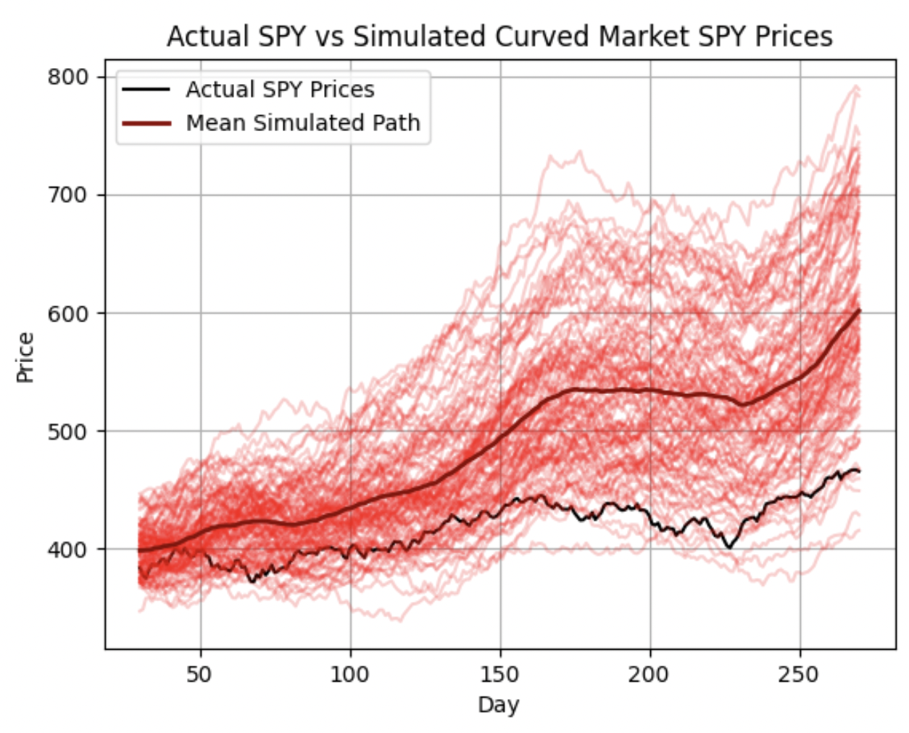

# Modeling Market Dynamics as Stochastic Processes on Curved Manifolds
*Inspired by Jim Simons' concept of holonomy from "The Man Who Solved the Market" by Gregory Zuckerman*

---

## Background to my Inspiration
Growing up, I loved the idea of owning your job by day trading — starting from nothing and trying to build something real with just discipline and focus. I tried all kinds of strategies — EMA crossovers, VWAP signals, combining technical setups with strong earnings — but I still saw trades fail for reasons I couldn’t explain. Everything would point in the right direction, and the stock would still tank.

Reading about holonomy in *The Man Who Solved the Market* made something click: maybe the market doesn’t move in a straight line. Maybe it curves, and that curve is shaped by all kinds of forces we don’t directly see - technical, fundamental, macro, even psychological. Holonomy helped me put a math word to something I already felt — that trades can drift off course as they move through this complex space.

Now I want to model that. I’m building a framework that treats the market as a path through a curved space. I’ll simulate price paths under “curvature” and compare them to standard Brownian motion models. Basically: can I turn this gut feeling I’ve had for years into something concrete and testable?

---

## Research Question
What if the market doesn't move in straight lines? How can we test how outside factors we don't directly see are creating structure for the market? Would a simulation using a bent path create a more accurate way to simulate prices?

---

## Summary
I created two models to try to simulate how SPY moved in 2023:

- **Flat Model:** regular Geometric Brownian Motion with constant drift and volitility
- **Curved Model:** changes the drift each day based on how strong the previous daily returns are (using a 30 day rolling Sharpe ratio)

I then compared both models to the real SPY prices to see which one tracked better (using a correlation coefficient)

---

## Key Results (Results may differ based on simulation)
| Model                | Correlation with SPY | Improvement |
|----------------------|----------------------|-------------|
| Flat GBM             | 0.7820               | —           |
| Curved GBM (α = 0.9) | 0.8700               | +11.26%     |
| Optimized Curved     | **0.8831**           | **+12.92%** |

---

## Visualizations
Flat model vs actual SPY
- 

Curved model vs actual SPY:
- 

Best-performing curved model (on this particular simulation it was alpha = 1.0):
- 

---

## Theoretical Background
Words

---

## How to Run

---

## Files

---

## Next Steps

---

## Author
Edward Peter Schwasnick
Statistics + CS Minor | University of Vermont
Quant Research Enthusiast
